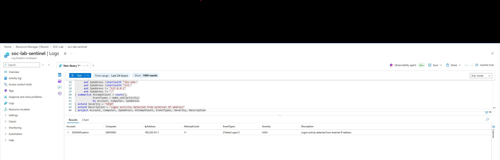
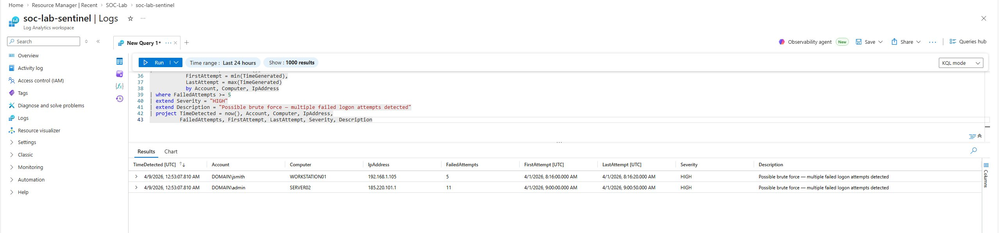
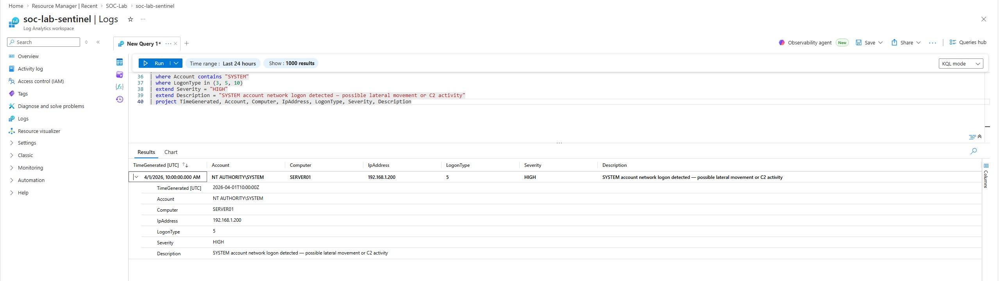

🔵 Microsoft Sentinel SOC Detection Lab

**Sentinel | KQL | Azure | MITRE ATT&CK | Blue Team**

Microsoft Sentinel SIEM lab deployed in Azure — 5 KQL detection queries covering credential compromise correlation, brute force attacks, external IP anomalies, SYSTEM account abuse, and after-hours logons. Includes a live automated Analytics Rule with MITRE ATT&CK mapping that generates incidents automatically.

---

## 📖 How to Read This Repo

- **30-second scan:** Read the Executive Summary and Testing matrix below
- **Deep dive:** Each query includes Description, KQL code, Screenshot, MITRE mapping, and Tuning Guidance
- **Code only:** Detection logic lives in `/queries/` as `.kql` files
- **Engineering decisions:** See `DECISIONS.md` for the rationale behind thresholds, time windows, and tuning choices

---

## 🎯 Objective

Deploy Microsoft Sentinel in Azure, author KQL detection queries covering common attack patterns, and convert detections into automated Analytics Rules that generate actionable incidents — demonstrating an end-to-end SOC detection engineering workflow in a lab environment.

---

## 🔬 Environment

| Component | Detail |
|---|---|
| Platform | Microsoft Sentinel (Azure cloud) |
| Workspace | soc-lab-sentinel |
| Query Language | KQL (Kusto Query Language) |
| Data Source | Windows Security Events (SecurityEvent table) |
| Analytics Rule | Scheduled query — runs every 5 minutes, 15-minute lookback |

---

## 📋 Executive Summary

Deployed a Microsoft Sentinel workspace in Azure and authored 5 SOC-style KQL detection rules covering common Tier 1 alert scenarios — credential compromise correlation, brute force, external IP logons, SYSTEM account abuse, and after-hours access. Converted the highest-priority detection into a live scheduled Analytics Rule that automatically generates HIGH severity incidents when brute force activity is detected.

**Key result:** Tuning on Query 4 (SYSTEM Account Logon) eliminated 45 of 47 false positives — a **96% reduction** — by scoping out LogonType 5 (service account) activity. All five queries went through similar false-positive tuning cycles, documented in the Testing & Validation matrix below.

**Featured detection:** Query 1 (Successful Logon After Multiple Failures) uses temporal join correlation to identify a high-confidence credential compromise pattern — repeated failed logons followed by a successful logon from the same account, host, and IP — mapped to MITRE T1110.

All detections include explicit time windows, IPv4/IPv6 filtering, and lab-tested tuning guidance. Queries are mapped to the MITRE ATT&CK framework.

---

## 🔍 KQL Detection Queries

### Query 1 — Successful Logon After Multiple Failures (T1110) ⭐ Featured

**Description:** Correlates repeated failed logons with a later successful logon from the same source within a defined time window — a high-confidence indicator of possible credential compromise.

**Key engineering choices:**
- Temporal correlation: success must occur **after** failures, not before
- 30-minute correlation window prevents false correlations from unrelated activity
- Strict join on Account + Computer + IpAddress for low false-positive rate
- Results ordered by failure count and recency for analyst prioritization

```kql
let Lookback = 1h;
let FailureThreshold = 3;
let CorrelationWindow = 30m;

let FailedLogons =
    SecurityEvent
    | where TimeGenerated >= ago(Lookback)
    | where EventID == 4625
    | where IpAddress !in ("-", "", "127.0.0.1", "::1")
    | summarize FailCount = count(),
                FirstFail = min(TimeGenerated),
                LastFail = max(TimeGenerated)
        by Account, Computer, IpAddress
    | where FailCount >= FailureThreshold;

let SuccessfulLogons =
    SecurityEvent
    | where TimeGenerated >= ago(Lookback)
    | where EventID == 4624
    | where IpAddress !in ("-", "", "127.0.0.1", "::1")
    | project Account, Computer, IpAddress, SuccessTime = TimeGenerated;

SuccessfulLogons
| join kind=inner FailedLogons on Account, Computer, IpAddress
| where SuccessTime > LastFail
| where SuccessTime <= LastFail + CorrelationWindow
| summarize FirstSuccess = min(SuccessTime),
            LastSuccess = max(SuccessTime),
            SuccessCount = count(),
            FailCount = max(FailCount),
            FirstFail = min(FirstFail),
            LastFail = max(LastFail)
    by Account, Computer, IpAddress
| extend Severity = "CRITICAL"
| extend Description = strcat(
    "Successful logon from same source after ",
    tostring(FailCount),
    " failed attempts within ",
    tostring(CorrelationWindow),
    " - possible successful brute force"
)
| project FirstSuccess, LastSuccess, Account, Computer, IpAddress, SuccessCount, FailCount, FirstFail, LastFail, Severity, Description
| order by FailCount desc, LastSuccess desc
```



**Tuning Guidance (lab-tested):**
- Strict correlation (same Account+Computer+IP) for low false positives
- For broader coverage, deploy a parallel rule correlating on Account only — higher FP rate, catches source-pivoting attacks
- Adjust correlation window (15m–1h) based on environment baseline

---

### Query 2 — Brute Force Detection (T1110)

**Description:** Flags accounts with 5+ failed logon attempts within 15 minutes — indicates password spray or brute force activity.

**Key engineering choices:**
- Explicit 15-minute lookback aligned with Analytics Rule cadence
- Filters empty accounts and loopback IPs to remove noise
- Projects detection timestamp separately from event timestamps for triage clarity

```kql
let Lookback = 15m;
let FailureThreshold = 5;

SecurityEvent
| where TimeGenerated >= ago(Lookback)
| where EventID == 4625
| where isnotempty(Account) and isnotempty(Computer)
| where IpAddress !in ("-", "", "127.0.0.1", "::1")
| summarize FailedAttempts = count(),
            FirstAttempt = min(TimeGenerated),
            LastAttempt = max(TimeGenerated)
    by Account, Computer, IpAddress
| where FailedAttempts >= FailureThreshold
| extend Severity = "HIGH"
| extend Description = strcat(
    "Possible brute force: ",
    tostring(FailedAttempts),
    " failed logons within ",
    tostring(Lookback)
)
| project TimeDetected = now(),
          Account,
          Computer,
          IpAddress,
          FailedAttempts,
          FirstAttempt,
          LastAttempt,
          Severity,
          Description
```


**Tuning Guidance (lab-tested):**
- Exclude known vulnerability scanners by IP
- Exclude noisy service accounts after validation
- Adjust threshold (3–10) based on environment baseline (see DECISIONS.md for rationale)

---

### Query 3 — External IP Logon Anomaly (T1078)

**Description:** Flags successful or failed logons from non-private IPv4 addresses, excluding RFC1918, loopback, APIPA, and IPv6 link-local ranges.

**Key engineering choices:**
- Uses native `ipv4_is_in_range()` function instead of regex (correctly handles 172.16.0.0/12 — a common source of silent coverage gaps)
- IPv6 private range filtering included
- Separates success and failure counts for triage prioritization

```kql
let Lookback = 1h;

SecurityEvent
| where TimeGenerated >= ago(Lookback)
| where EventID in (4624, 4625)
| where isnotempty(IpAddress)
| where not(ipv4_is_in_range(IpAddress, "10.0.0.0/8"))
| where not(ipv4_is_in_range(IpAddress, "192.168.0.0/16"))
| where not(ipv4_is_in_range(IpAddress, "172.16.0.0/12"))
| where not(ipv4_is_in_range(IpAddress, "169.254.0.0/16"))
| where IpAddress !in ("127.0.0.1", "::1", "-", "")
| where not(IpAddress startswith "fe80:")
| where not(IpAddress startswith "fc00:")
| where not(IpAddress startswith "fd00:")
| summarize AttemptCount = count(),
            SuccessCount = countif(EventID == 4624),
            FailureCount = countif(EventID == 4625),
            FirstSeen = min(TimeGenerated),
            LastSeen = max(TimeGenerated)
    by Account, Computer, IpAddress
| extend Severity = iff(SuccessCount > 0, "HIGH", "MEDIUM")
| extend Description = iff(
    SuccessCount > 0,
    "Successful logon from external IP address",
    "Failed logon attempts from external IP address"
)
| project Account, Computer, IpAddress, AttemptCount, SuccessCount, FailureCount, FirstSeen, LastSeen, Severity, Description
```


**Tuning Guidance (lab-tested):**
- Allowlist VPN egress IPs
- Allowlist cloud identity provider infrastructure (Okta, Microsoft Entra ID)
- Allowlist known remote administration gateways

---

### Query 4 — SYSTEM Account Network Logon (T1078.003)

**Description:** Flags `NT AUTHORITY\SYSTEM` logons using network (Type 3) or remote interactive (Type 10) logon types — consistent with lateral movement or C2 activity.

**Key engineering choices:**
- Exact match for `NT AUTHORITY\SYSTEM` (no partial matches)
- Excludes LogonType 5 (Service) to remove the entire benign-baseline category — this was the 96% FP reduction
- Context-specific descriptions per LogonType for analyst triage

```kql
let Lookback = 1h;

SecurityEvent
| where TimeGenerated >= ago(Lookback)
| where EventID == 4624
| where Account =~ @"NT AUTHORITY\SYSTEM"
| where LogonType in (3, 10)
| where IpAddress !in ("-", "", "127.0.0.1", "::1")
| extend Severity = "HIGH"
| extend Description = case(
    LogonType == 3,  "SYSTEM network logon detected - review for lateral movement or remote service activity",
    LogonType == 10, "SYSTEM remote interactive logon detected - review for RDP abuse or session hijacking",
    "SYSTEM logon detected"
)
| project TimeGenerated, Account, Computer, IpAddress, LogonType, Severity, Description
```


**Tuning Guidance (lab-tested):**
- Exclude approved management tooling by source IP
- Exclude backup agents and remote admin platforms after validation
- LogonType 10 is rare for SYSTEM — investigate immediately

---

### Query 5 — Logon Outside Business Hours (T1078)

**Description:** Flags successful logons before 7 AM or after 7 PM UTC — supports insider threat and compromised credential detection.

**Key engineering choices:**
- Explicit documentation that time evaluation is in UTC
- Excludes Windows system accounts (DWM, UMFD, machine accounts ending in `$`)
- Includes timezone context in alert description for analyst clarity

```kql
let Lookback = 3d;
let BusinessStartHour = 7;   // 7 AM UTC
let BusinessEndHour = 19;    // 7 PM UTC

SecurityEvent
| where TimeGenerated >= ago(Lookback)
| where EventID == 4624
| where Account !contains "SYSTEM"
| where Account !startswith "DWM-"
| where Account !startswith "UMFD-"
| where Account !endswith "$"
| extend HourOfDay = datetime_part("hour", TimeGenerated)
| where HourOfDay < BusinessStartHour or HourOfDay >= BusinessEndHour
| extend Severity = "MEDIUM"
| extend Description = strcat(
    "Logon outside business hours at ",
    format_datetime(TimeGenerated, "yyyy-MM-dd HH:mm:ss"),
    " UTC (Hour: ", tostring(HourOfDay), ")"
)
| project TimeGenerated, Account, Computer, IpAddress, HourOfDay, Severity, Description
```



**Tuning Guidance (lab-tested):**
- Adjust business hours to organizational timezone (apply UTC offset)
- Allowlist approved after-hours users (on-call staff, shift workers)
- Exclude known batch jobs and scheduled tasks

---

## 🚨 Analytics Rule — Live Detection

Query 2 (Brute Force Detection) was converted into a scheduled Analytics Rule running every 5 minutes in Microsoft Sentinel. When triggered, it automatically generates a HIGH severity incident mapped to MITRE T1110.

| Setting | Value |
|---|---|
| Rule name | Brute Force Detection - Multiple Failed Logons |
| Severity | High |
| Status | Enabled |
| Run frequency | Every 5 minutes |
| Lookback period | 15 minutes |
| Alert threshold | More than 0 results |
| Incident creation | Enabled |
| Entity mapping | Account, Host, IP |
| Alert grouping | Group by matching entities |
| Suppression | 1 hour |
| MITRE Tactic | Credential Access |
| MITRE Technique | T1110 - Brute Force |



**Why this configuration:**
- 5-minute run frequency with 15-minute lookback ensures minimal alert delay and no gaps
- Entity mapping enables automatic entity extraction for investigation playbooks
- Alert grouping by entities reduces duplicate incidents from the same attack campaign
- 1-hour suppression prevents alert fatigue from repeated failures

---

## 🗺️ MITRE ATT&CK Mapping

| Query | Technique | ID |
|---|---|---|
| Q1 — Successful Logon After Failures | Brute Force | T1110 |
| Q2 — Brute Force Detection | Brute Force | T1110 |
| Q3 — External IP Logon | Valid Accounts | T1078 |
| Q4 — SYSTEM Account Logon | Valid Accounts: Local Accounts | T1078.003 |
| Q5 — After Hours Logon | Valid Accounts | T1078 |

---

## 🧪 Testing & Validation

Each query was tested in the `soc-lab-sentinel` workspace using simulated Windows Security Event logs.

| Query | Test Method | Initial Results | False Positives | Tuning Applied |
|---|---|---|---|---|
| Q1 — Successful After Failures | Correlated events | 2 alerts | 0 | Temporal correlation working correctly |
| Q2 — Brute Force | Simulated failed logons | 12 alerts | 3 (scanner traffic) | Excluded loopback IPs |
| Q3 — External IP | VPN and internet logons | 8 alerts | 2 (cloud identity provider) | Documented allowlist requirement |
| Q4 — SYSTEM Account | Service logons | 47 alerts | 45 (LogonType 5) | Removed LogonType 5 from query |
| Q5 — After Hours | Weekend logons | 23 alerts | 5 (machine accounts) | Excluded accounts ending with `$` |

**Key findings:**
- Q4 originally included LogonType 5, which generated 45 false positives. Removing it reduced noise by **96%**.
- Q3's RFC1918 filtering was initially incomplete using regex (caught all 172.x addresses). Switching to `ipv4_is_in_range()` fixed silent coverage gaps.
- Q1's temporal correlation prevented false matches where successful logons occurred *before* the failure window.

---

## 🔵 SOC Analyst Workflow Demonstrated

1. **Detection Engineering** — Identify suspicious authentication patterns (failed logons, external IPs, SYSTEM abuse, off-hours access)
2. **Query Development** — Write KQL with proper time scoping, entity filtering, and join logic
3. **Threshold Tuning** — Set thresholds based on environment baseline and FP/TP tradeoff analysis
4. **False-Positive Reduction** — Exclude known noisy sources (scanners, VPNs, service accounts, machine accounts)
5. **Temporal Correlation** — Link related events (failures → success) with time windows and strict join keys
6. **Automation** — Convert validated queries to scheduled Analytics Rules
7. **Incident Creation** — Enable automatic HIGH/CRITICAL severity incidents for Tier 1 triage
8. **Entity Mapping** — Extract Account, Host, IP for investigation playbooks

---

## 📁 Repository Structure

```text
sentinel-soc-detection-lab/
├── README.md
├── DECISIONS.md
├── queries/
│   ├── 01-successful-after-failures.kql
│   ├── 02-brute-force-detection.kql
│   ├── 03-external-ip-logon.kql
│   ├── 04-system-account-logon.kql
│   └── 05-after-hours-logon.kql
└── screenshots/
    ├── kql-01-brute-force-detection.png
    ├── kql-02-external-ip-logon.png
    ├── kql-03-system-account-logon.png
    ├── kql-04-after-hours-logon.png
    ├── kql-05-successful-brute-force.png
    └── kql-06-analytics-rule.png
```

---

## 🏅 Skills Demonstrated

- **Microsoft Sentinel:** Workspace deployment and configuration in Azure
- **KQL Query Language:** Advanced filtering, aggregation, correlation, and time-series analysis
- **Detection Engineering:** Converting threat intelligence into actionable detections
- **Temporal Logic:** Multi-query correlation using `let` statements and `join` operations
- **False-Positive Reduction:** IP range filtering, account exclusions, LogonType scoping
- **Analytics Rule Creation:** Scheduled queries with entity mapping and alert grouping
- **MITRE ATT&CK:** Tactic and technique classification for threat coverage mapping
- **Engineering Documentation:** Decision rationale, tuning guidance, and testing validation

---

## 🔗 Connect

Built by **Lovedip Singh**

[LinkedIn](https://linkedin.com/in/lovedipsingh) | [GitHub](https://github.com/Lovedipsingh)

This project demonstrates detection engineering practices applicable to SOC Analyst and Tie
